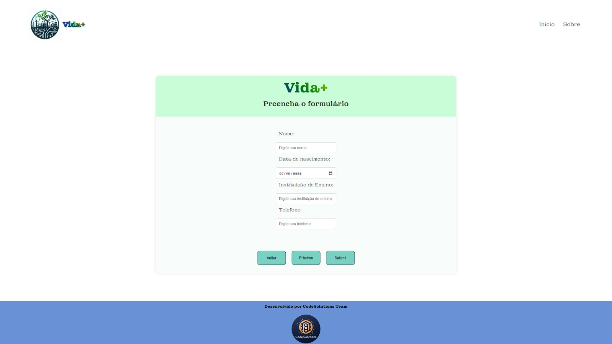
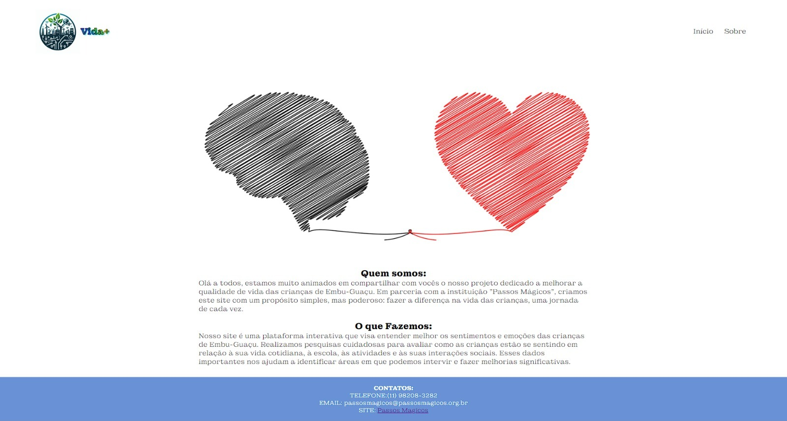

# Projeto Vida+ 🌟

## Introdução
O **Projeto Vida+** é uma iniciativa desenvolvida durante o Hackathon da FIAP+Alura em colaboração com a equipe dos Passos Mágicos. O objetivo é analisar padrões de saúde mental e alimentar, utilizando escalas cientificamente reconhecidas, tais como as escalas Ketcher e EBIA. O enfoque é tornar o processo amigável para crianças, utilizando perguntas com emojis.

## Objetivo
Nosso propósito é promover a saúde em Embu-Guaçu, visando uma comunidade mais saudável e feliz, unindo ideias com a organização Passos Mágicos.

## Protocolo
O Vida+ permite que os usuários respondam perguntas semanalmente, inserindo informações relevantes que são armazenadas em um banco de dados. Com base nessas respostas, é gerado um protocolo que é encaminhado a um psicólogo para um atendimento personalizado.

## Imagens do Projeto
Aqui estão algumas imagens que representam o início e uma visão sobre o Vida+:
-  - Tela inicial do Vida+
-  - Visão geral sobre o Projeto Vida+

## Video do pitching sobre o projeto
-[YouTube](https://www.youtube.com/watch?v=PMIijaenY24&ab_channel=ViniciusChiazza)

## Como Usar
1. Responda todas as perguntas semanalmente.
2. Encaminhe seu perfil para o banco de dados.
3. Aguarde a análise com um profissional de saúde.

## Tecnologias Utilizadas
- HTML
- CSS
- Javascript
- JAVA
- SQL

## Equipe CodeSolutions
Conheça a equipe que tornou o Vida+ uma realidade:
- Vinicius Chiazza - Front-end [GitHub](https://github.com/ViniciusChiazza) 👨‍💻
- Bruno Fernando - Back-end [GitHub](https://github.com/bfernandodco) 👨‍💻
- Robson Gomes - Back-end [GitHub](https://github.com/robsonrccha) 👨‍💻
- Cristian Santos - Front-end [GitHub](https://github.com/cristian-santos) 👩‍💻
- Raquel Sofia - Front-end [GitHub](https://github.com/RaquelGuerreiro21) 👩‍💻

## Agradecimentos Especiais
Agradecemos às instituições que tornaram este projeto possível:
- [FIAP](https://www.fiap.com.br/) 🎓
- [Alura](https://www.alura.com.br/) 💼
- [Passos Mágicos](https://www.passosmagicos.org/) ✨

Vamos juntos promover uma vida mais saudável e feliz! 💪🌈
